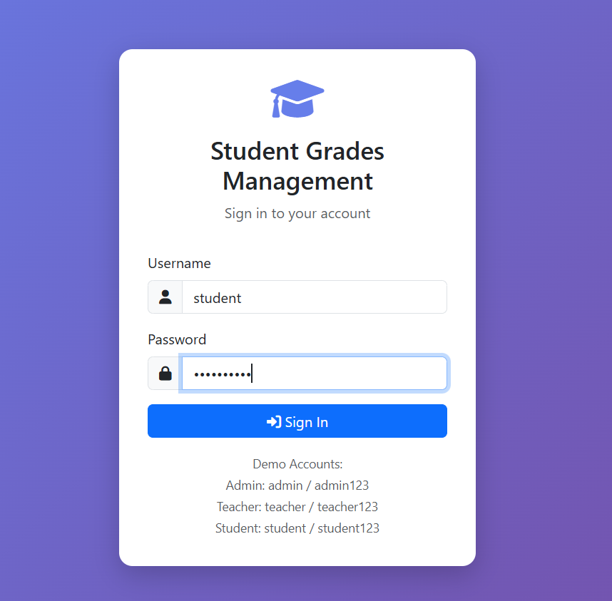
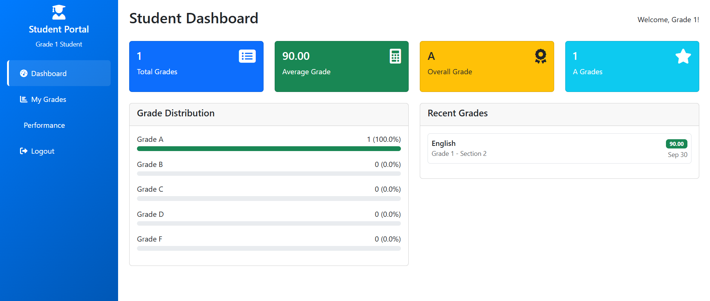
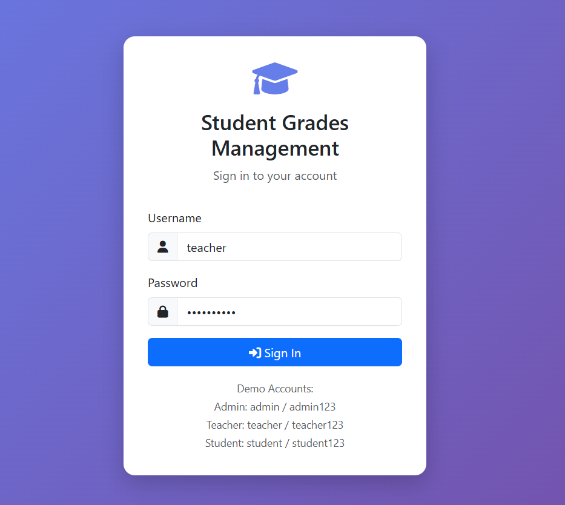
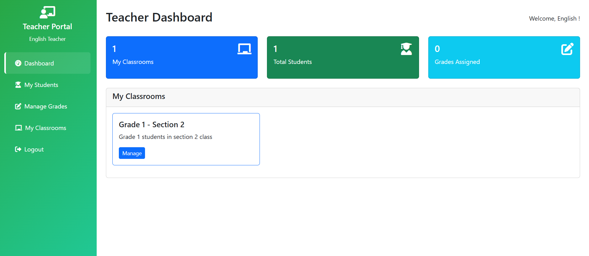
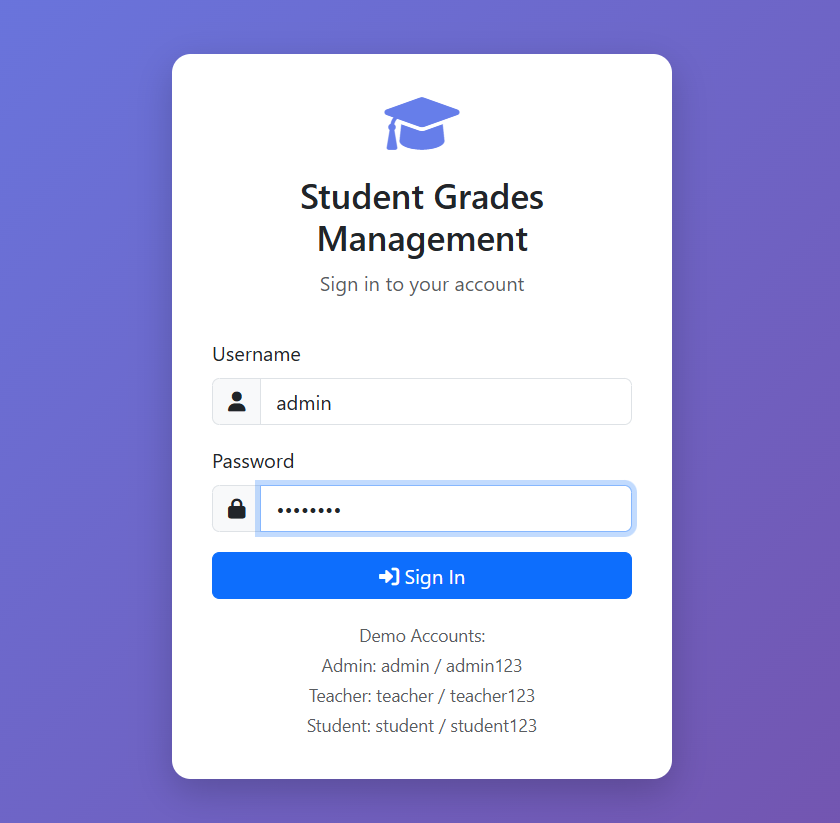
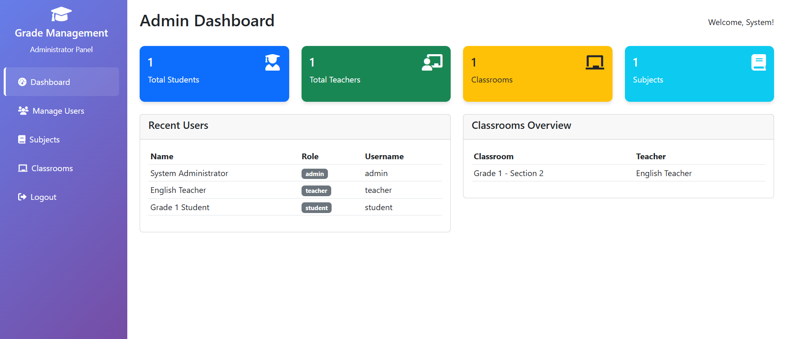

🎓 Student Grades Management System

A simple web-based **Student Grades Management System** built using **PHP** and **MySQL**. This project allows admins and teachers to manage students, classrooms, and grades, while students can view their academic performance.

 🧰 Technologies Used

- **PHP** (for server-side logic)
- **MySQL** (for database management)
- **Apache** (via WAMP server)

📁 Project Structure
student-grades-management-system/
├── admin.php
├── classroom.php
├── grades.php
├── index.php
├── logout.php
├── students.php
├── teacher.php
├── img/
│ ├── output1.png
│ ├── output2.png
│ ├── output3.png
│ ├── output4.png
│ ├── output5.png
│ └── output6.png
└── README.md

---

## 📸 Screenshots

> Below are key pages from the system:

### 🔐 StudentLogin Page

### 🏠 Student Dashboard

### 👩‍🏫 TeacherLogin Page

### 👨‍🎓 Teacher View

### 📊 AdminLogin Page

### 🚪 Admin Dashboard

🛠️ How to Run This Project
 1. 🖥️ Requirements
- **WAMP** (or any Apache + PHP + MySQL stack)
- A browser (Chrome, Firefox, etc.)

2. 📂 Setup Steps

a. Move the Project
Place the folder inside your WAMP server’s root directory:

b. Create the Database
1. Open [http://localhost/phpmyadmin](http://localhost/phpmyadmin)
2. Create a new database (e.g., `grades_db`)
3. Import your `.sql` file (if available)  
   _If not, create tables manually (`students`, `teachers`, `grades`, etc.)_
   
c. Configure the Database Connection (if needed)
If you have a `config.php` or DB connection file, ensure it uses:

php:
$host = 'localhost';
$user = 'root';
$password = '';
$dbname = 'grades_db';

d. Start WAMP & Access the System
Start WAMP and wait until the icon is green
Visit in browser:
http://localhost/student-grades-management-system/

🔐 Default Login
If the system does not have a registration page, manually insert an admin user into the database using phpMyAdmin.

📃 License
This project is open-source. Use it freely for learning, academic projects, or customization.
